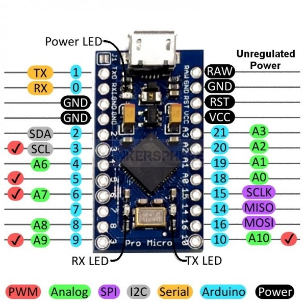

# Arduino Workshop

Workshop Arduino Introduction for 2 Devine, Spring 2021.

In this workshop we'll cover the basics of Arduino, and move to Johnny-Five with Electron to build interactive applications combining computer and Arduino interaction.

## What's Arduino?

Arduino is a collection of 3 tools, forming the Arduino Toolkit. First of all, there's the Arduino controller (hardware), which is available in many formats. The schematics are open source, and everybody can assemble them on their own if wanted. The second part of the Arduino Toolkit is the language and compiler. These enable you to write programs to execute by the controller. Lastly, we've got the Arduino IDE: the coding environment where you can write an Arduino program and upload to a controller.

The goal of Arduino is to enable people to easily build interactive installations, linking hardware and software together. You can read input from different kinds of sensors (push buttons, light sensors, temperature sensors, gyroscopes, distance sensors, ...) and control other electronics (leds, motors, ...)

## Installation and setup

You'll need an Arduino compatible board. You can check a list of supported boards at https://www.arduino.cc/en/Main/Products. We will be using an Arduino Micro board during this course. Next to a board, you'll need some LEDs, resistors, sensors, ...

Additionally, you'll need the Arduino IDE. Download the Arduino IDE at https://www.arduino.cc/en/Main/Software

### Hello Arduino

We'll do a first quick test of your Arduino board and the IDE. Open op the Arduino IDE. You'll be presented with a screen like the image below:


It consists of a large text area where you'll write your code, a button bar on top, a logging area below and a status bar.

We will try to blink an on-board LED on our Arduino.

1. Copy / Paste the following code into our IDE:

```c
int RXLED = 17; // on an Arduino Micro, PIN 17 is an onboard LED pin

void setup() {
  pinMode(RXLED, OUTPUT);
}

void loop() {
  digitalWrite(RXLED, HIGH);
  delay(1000);
  digitalWrite(RXLED, LOW);
  delay(1000);
}
```

2. Connect your Arduino Board on a free USB port.
3. Make sure that `Tools > Board > Arduino Micro` is selected in the menu.
4. Make sure that a port with an Arduino is selected in `Tools > Port`. The usb port with the arduino should mention something like "Arduino" at the end.
5. Click on the right-pointing arrow button to upload the Sketch to the board.

If everything works as it should, you should see the onboard LED blink on the board!


Take a look at the code from this example. The language you write Arduino code in is the C programming language. We can identify a couple of parts in this Sketch:

- `void setup()`: The code in this function only runs once at startup of the program
- `void loop()`: The code in this function runs continuously. As soon as this function exits, it runs again. You can interpret this as some sort of endless loop.
- `pinMode`: By using this function you can configure a certain pin on the arduino as either OUTPUT or INPUT. An output pin is used to drive an external component, whereas an INPUT pin is used to read a value from a pin (eg to read a sensor value).
- `digitalWrite`: We use this function to write a binary value (HIGH or LOW) to a given pin number.
- `delay`: This function pauses the execution of the program for a given amount of time in milliseconds.

## A first electrical circuit

Let's spice things up a little bit. Instead of blinking the on board LED, we'll connect a real LED to the Arduino.

To make an LED light up, it'll need electricity running through it. That electric current needs to flow from somewhere to a destination. Just like water in a rivier, it will flow from a high potential to a low potential. You'll need to be careful about the amount of current flowing through the LED at any given time. Just like with the river analogy, too much current / pressure might destroy a component (our LED). We will add a resistor to our circuit, to limit the current.

We've used a couple of terms in the paragraph above, which are expressed in different units:

- Voltage (V): the difference between the high and low potential in a circuit, expressed in Volts.
- Current (I): the amount of current flowing in a circuit, expressed in Ampere.
- Resistance (R): a resistance in a circuit, expressed in Ohms.

There is a close connection between these 3, expressed in Ohm's law. As you can read on the [Wikipedia page on Ohm's law](https://en.wikipedia.org/wiki/Ohm's_law): "Ohm's law states that the current through a conductor between two points is directly proportional to the voltage across the two points."


Where I stands for current, V for voltage and R for resistance.

### An LED in a circuit

When we want to connect an LED to an Arduino, we'd hook up the short side to a ground pin (GND) and the long side through a resistor to an output pin:


Most of the Arduino examples you'll find are shown with an Arduino UNO board. As we're using an Arduino Pro Micro board, you'll need to look for the same pin numbers or pins with the same functionality on your Arduino Pro Micro board:



We could get our hands dirty with a soldering iron, and melt wires and components together, but this would be a pretty slow prototyping / testing proces. Instead of that, we'll use a breadboard.

Breadboards make it easier to prototype electronic circuits. Make sure to [read the chapter "Anatomy of a breadboard" on the Sparkfun website](https://learn.sparkfun.com/tutorials/how-to-use-a-breadboard/#anatomy-of-a-breadboard) before continuing.

Build the circuit below using a breadboard and test the Blink example again (make sure the pin number in your code and the physical pin number match). The LED should turn on and off.


If it doesn't, check the following potential issues:

- The long connector from the LED should be connected to pin 13.
- The resistor should have a value below 1000 Ohms (1 KOhm). Resistance values can be read using the colored stripes on them (see [resistor-calculator.com](http://www.resistor-calculator.com/)). The one in the picture is a 220 Ohm resistor.

## Arduino and Javascript

Until now, we've been writing C code to program our Arduino. Wouldn't it be fun to combine our Arduino sensors and outputs with our javascript frontends?

Using [Electron](https://electronjs.org) and [Johnny-Five](http://johnny-five.io) we can do just that! We'll upload a generic sketch (Firmata) to the Arduino and give it instructions over USB from within our Javascript code.

### Node Version

Make sure to use a recent version of node. At time of writing, node versions below node 15 weren't working properly with the current versions of electron and johnny-five.

Check your current node version using the command below:

```bash
node -v
```

It'll echo the node versions number. For example:

> v14.16.1

Let's update to version 16.1.0, using [nvm](https://github.com/nvm-sh/nvm):

```bash
nvm install v16.1.0
```

You can set this as your default version as well (so this is the version used when opening a new terminal):

```bash
nvm alias default v16.1.0
```

### Electron

First of all, we'll run our javascript inside an Electron App. Basically, Electron is a mashup of nodejs and the Chromium rendering engine. You'll run you webpages (including javascript) locally, as a desktop application. This enables you to do everything you could do in a nodejs application but from within your frontend javascript code: access the filesystem, interact with hardware, talk to C++ extensions, ...

You're probably already using a couple of Desktop apps built using Electron: Visual Studio Code, Atom, Slack, Hyper, Github Desktop... are all built on top of Electron.

An easy way to get started is by using the [electron-webpack-quick-start project](https://webpack.electron.build/) as a starter project. 

```bash
git clone https://github.com/electron-userland/electron-webpack-quick-start p01-blink
cd p01-blink
npm install
```

Test launching the project, by running the dev script:

```bash
npm run dev
```

An electron window should open.

### Johnny Five

Johnny Five is a library which enables you to talk to electronics from Javascript. It uses a standard protocol, called Firmata, to send instructions to the Arduino over the USB connection. An instruction could be turn on an LED, read a sensor value, move a servo, ...

First of all, you'll need an Arduino with the StandardFirmata sketch. Upload this Sketch (`File > Examples > Firmata > StandardFirmata`) to your Arduino UNO.

Next to that, make sure you've got node-gyp installed globally: `npm install -g node-gyp`

#### Hello Johnny Five

We'll expand the electron-quick-start project to control an Arduino using Johnny five.

Add Johnny-five to the project:

```bash
npm install johnny-five
```

Add the necessary code to `src/renderer/index.js` to talk to the board from within the renderer javascript:

```javascript
const five = require('johnny-five');
const board = new five.Board({
  repl: false
});

board.on("ready", () => {
  const led = new five.Led(9);
  led.blink(500);
});
```

Test the application using `npm run dev`. You won't see anything happen. If you open the devtools, there's probably an error message there:

> Uncaught Error: The module 'projects/p01-blink/node_modules/@serialport/bindings/build/Release/bindings.node' was compiled against a different Node.js version using NODE_MODULE_VERSION 88. This version of Node.js requires NODE_MODULE_VERSION 76. Please try re-compiling or re-installing the module (for instance, using `npm rebuild` or `npm install`).

Johnny five uses a module called serialport, which uses some C++ code to send messages over USB. This C++ code is compiled for nodejs by default, but we're using an electron flavor of node! We'll need to make sure this C++ code is compatible with Electron.

Add an extra script to the scripts section of your package.json:

```
"rebuild-deps": "electron-builder install-app-deps"
```

Run the rebuild-deps script:

```bash
npm run rebuild-deps
```

Launch the app again. The error should be gone now.

Connect an LED to the port specified in your javascript code, you should see it blink!

### Components to test

You've got a lot of different components in your kit, which you can use with johnny five. Build and test the following examples:

#### Inputs

- Button: http://johnny-five.io/examples/button/
- Potentiometer: http://johnny-five.io/examples/potentiometer/ - try this out with the joystick from your kit as well! The joystick is a combination of 2 potentionmeters and one push button.
- Photoresistor: http://johnny-five.io/examples/photoresistor/. You can use this to create a laser-tripwire (http://johnny-five.io/examples/laser-trip-wire/), ask the professor for a laser diode to play with.
- Ultrasonic Sensor: http://johnny-five.io/examples/proximity-hcsr04/ (note: you'll need to upload a different firmata sketch first)

#### Outputs

- Piezzo sound: http://johnny-five.io/examples/piezo/
- DC motor: http://johnny-five.io/examples/motor/
- Servo motor(ask the professor for a servo to play with): http://johnny-five.io/examples/servo/

### Modifying the html

You'll read the following on https://webpack.electron.build/development.html#use-of-html-webpack-plugin

> You might notice that you don’t need an index.html to get started on your application. That’s because it is created for you, as it adds in a few extra configurations needed for the electron environment. If you are creating an electron application with webpack, you are most likely creating a Single Page Application anyways. So because of that, there is already a <div id="app"></div> provided in the markup that you can mount your application onto.

If you do want to have a custom html, we'll need to extend the  webpack config of our project. Add a config object for electron webpack to our package.json (see docs at https://webpack.electron.build/configuration for more info), containing the path to your html file:

```
"electronWebpack": {
  "renderer": {
    "template": "src/renderer/index.html"
  }
}
```

Put an html file in that location and test the application. You should see your custom html.

### Combinations

Use your imagination to combine inputs with outputs. Sound a piezzo alarm when the laser tripwire gets triggered. Control a servo angle based on the distance of your ultrasonic sensor. Use the joystick as a speed controller for your DC motor.

Because you are in javascript land, you can combine the hardware with browser logic. Make sure to try the following projects:

1. Fade an LED using an `<input type="range">`
2. Change a servo angle based on the x position of your mouse pointer on the screen
3. Control the background color of your `<body>` tag using a potentiometer or a light sensor
4. Build a basic arcade game (pong, breakout) and control it using an Arduino sensor

## Other things to check

- [View Arduino, The documentary](https://vimeo.com/18539129) (28 min)
- [DIY Pressure Sensor](https://www.youtube.com/watch?v=_RUZtsQzSLY)
- [Star Wars Imperial March with Floppy and Arduino](https://www.youtube.com/watch?v=B_Q6jMUdfYc)
- [The breakfast machine](https://www.youtube.com/watch?v=E2evC2xTNWg)
- [Lunar Trails](https://vimeo.com/54043239)
- [NES Zapper Gun hack](https://vimeo.com/181220188)
- [NIghtwriter Nyx](http://www.gijsvanbon.nl/nyx1.html)
- [Whiteboard Clock](https://www.youtube.com/watch?v=4QgeQAiSmM8)
- [Neil Mendoza](http://www.neilmendoza.com/)
- [Anouk Wipprecht](http://www.anoukwipprecht.nl/gallery)
